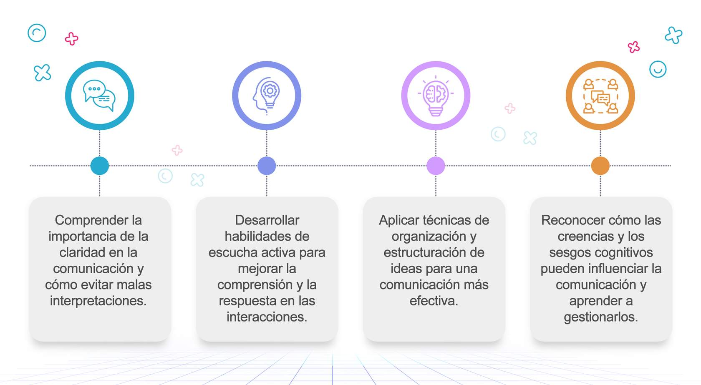

# Tema 1: Ondas de energía: dominando la comunicación

## Objetivos de aprendizaje

## Lección 1
Los sesgos y creencias que nos influencian 

*Material de uso educativo 

¿Qué son las creencias los sesgos cognitivos? 

Las creencias son ideas o pensamientos que tenemos en nuestra cabeza sobre cómo son las cosas y han sido adquiridos por medio de nuestras experiencias de vida, la crianza de nuestra familia y la sociedad en la que nos encontramos.

Los sesgos cognitivos son atajos mentales que nos ayudan a llegar más fácil a una conclusión, siendo en algunos casos errores que afectan nuestras decisiones y percepciones.

- Efecto del falso consenso:
Cuando creemos que hay mas gente que esta de acuerdo con nosotros de lo que realmente es el caso

¡Todo el mundo piensa eso!

- Sesgo de correspondencia:
Juzgamos a los demás por su personalidad, pero a nosotros mismo por la situación.

María llega tarde a clase; es perezosa. Yo llego tarde; tengo un día malo

- Efecto halo:
Si ves una persona con un rasgo positivo, esa impresión positiva se extenderá a otros rasgos.

María nunca podría ser mala; ¡Es tan guapa!”

- Cinismo ingenuo:
Tendencia a esperar un sesgo más egocéntrico en los demás que en uno mismo

 “La única razón por la que esta persona está haciendo algo bueno es para sacar algo    de mi”

¿Por qué influencian nuestra comunicación?

Las creencias y los sesgos cognitivos pueden distorsionar nuestra percepción de la realidad y afectar nuestras interacciones con los demás. 

Pueden llevarnos a conclusiones incorrectas y afectar la forma en que nos comunicamos y tomamos decisiones.

## Lección 2
Conceptos útiles y claves de la 
comunicación efectiva

Claridad

Debemos tratar de expresarnos de manera comprensible y precisa, evita malas interpretaciones y genera conexión con lo que quieres decir:

- Se conciso

Usa frases cortas y directas.

- Evita tecnicismos y jergas

Utiliza un lenguaje accesible para todos, y más cuando no conoces a todos los que te escuchan.

- Organiza tus ideas

Presenta la información de manera lógica y estructurada.

- Ejemplo

Mensaje no claro: "Necesitamos revisar las cosas esas del proyecto."

Mensaje claro: "Necesitamos revisar el presupuesto y las personas responsables del progreso del proyecto."

## 